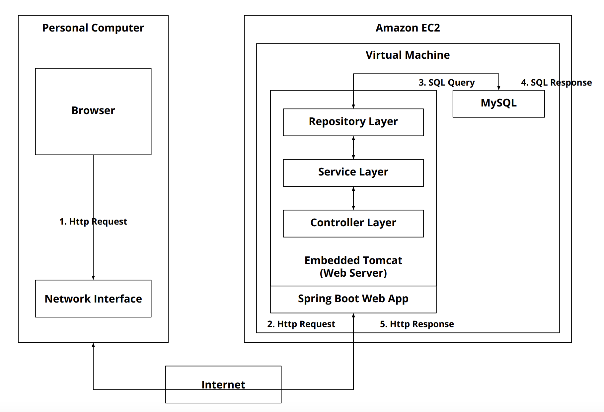
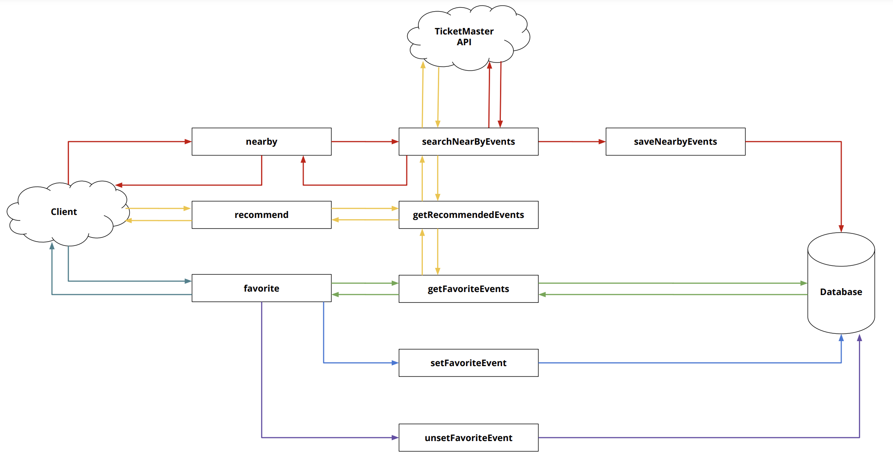
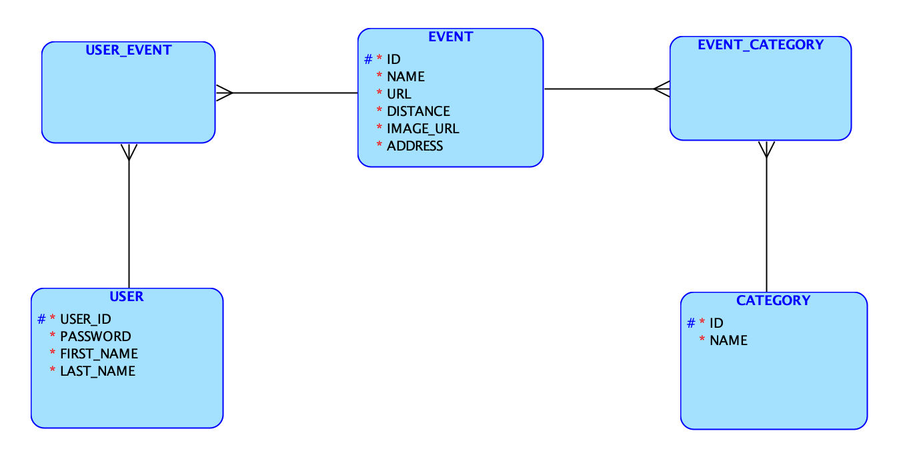

# NexEvent Application

NexEvent is a Spring Boot application designed for personalized event discovery and recommendations. The application uses a MySQL database, Redis for caching, and integrates with the Ticketmaster API.

**Deployed on AWS EC2:**  
[http://ec2-3-140-233-85.us-east-2.compute.amazonaws.com:8080/](http://ec2-3-140-233-85.us-east-2.compute.amazonaws.com:8080/)

---

## System Overview

### 1. System Architecture

### 2. Data Flow Diagram

### 3. Database Logical Design

---

## Features

- Search for nearby events using the Ticketmaster API.
- Update user preferences.
- Receive personalized event recommendations.
- Optimized with Redis for caching.

---

## How to Run

For detailed setup and running instructions, refer to the [SETUP.md](SETUP.md) file.

---

## Deployment Instructions

For AWS EC2 deployment steps, refer to the [DEPLOYMENT.md](DEPLOYMENT.md) file.
